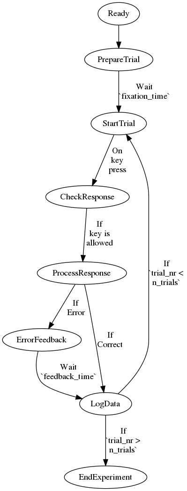

# Template Experiment: Flanker Task

This is a basic template experiment,
to be used as a starting point when building new tasks.


## The Experiment

The files for the experiment itself are in the `public/` folder.
It contains:

- `index.html`: The main html page
- `static/`
  - `static/main.css`: Custom CSS styling
  - `static/main.js`: JavaScript logic for the experiment
  - `static/utils.js`: Some useful JavaScript functions
- `libs/`: Packages used in `index.html`.

## Primate.js

This experiment uses the [`primate.js`](https://github.com/eointravers/primate.js) library
I've created for working with Gorilla.
Primate provides a simple wrapper around the Gorilla API,
letting you run the same code on Gorilla and off it.
See https://github.com/eointravers/primate.js for details.


## Uploading to Gorilla

The Gorilla version of this task can be found
[in Gorilla Open Materials](https://gorilla.sc/admin/project/15370).
There is a one-to-one mapping between files in this folder and elements in the Gorilla task.

- The `utils.js` and `main.js` tabs on Gorilla contain direct copies of the eponymous files.
- The `body.html` template on Gorilla contains
  the main HTML elements defined in `index.html`.
  There are comments within that file to make clear which bits these are.
- The `Style` tab on Gorilla contains the contents of `main.css`.
  It also includes an additional line at the start,
  `@import '/style/style.less';`
  which loads Gorilla's own style sheets, and should be preserved.
- The `Resources` tab on Gorilla lets us upload libraries we need.
  This already contains `lodash.min.js` and `primate.js`
  (saved here in `libs/`). Gorilla automatically includes `jQuery` and `Bootstrap`,
  so we don't need to add them here.
- The `Head` tab includes the code needed to include the above resources
  when loading the page. This doesn't need to be changed, unless you're adding new libraries.
- The `Manipulations` tab controls between-subject manipulations in Gorilla.
  See below.
- You need to specify every value you want to log in the `Metrics` tab.
  See below for an easy way to do this.

## Manipulations

The `Manipulations` tab in Gorilla controls between-subject manipulations.
The only manipulation in this template is whether the font
is big (`big_font=1`) or small (`big_font=0`).
It's generally easiest to use binary codes for these manipulations,
rather than, say, `font="big"` versus `font="small"`.

You'll need to add any manipulations for your experiment manually,
not forgetting to remove the `big_font` one.
I usually take the approach of using
calling, e.g.

```js
let big_font = primate.manipulation('big_font', flip());
```

which gets the value of the Gorilla manipulation `big_font` if running on Gorilla,
and uses the default &mdash; the output of `flip()`, either `0` or `1` &mdash; otherwise.
You can do something similar for multinomial manipulations,

```js
let group = primate.manipulation('group',
                                 _.sample(['conflict', 'active_control', 'passive_control']))
```
where the default is randomly chosen from the list of options.

## Metrics

Gorilla requires that you specify every variable
to be recorded in your task in the `Metrics` tab.
Fortunately, we code these experiments in such a way that
everything we want to log is stored in the `state` object, defined in `main.js`,
which is just a dictionary of labels and corresponding values.

```js
let state = {
    width: null,
    height: null,
    subject_nr: null,
    // ...
    accuracy: null
};
```

To make this process even easier,
there is a python script in this repository,
located at `/Source/Gorilla/get_metrics.py`.
Open it up, change the value of the `filepath` variable
to point to the `main.js` file for your experiment,  and run it.
It will print out a list of the metrics to be recorded,
along with some JavaScript command you can
run on the Gorilla website to automatically add these metrics
to the experiment.

# Design Philosophy

There are a few ways of going about building online experiments.
I'll briefly outline the approach taken here.
I'll be posting a more detailed guide in the future.

## Building in HTML

`index.html` is the HTML file which defines the contents of our experiment.
We explicitly define all of the visual elements of the experiment here -
everything we wish to display on the screen.
Everything in this experiment happens to be text:
the instructions, the fixation cross,
the target stimuli ("<<><<"),
the feedback, and the message at the end.

## Styling in CSS

We use CSS (`static/main.css`) to specify how these visual elements should look.
For instance, the main text elements should be located in the center of the screen,
the fixation cross font size should be `4em` (four times the default),
and the fixation and target should be in a monospaced font.

## Interacting in JavaScipt

We use JavaScript primarily to maniupulate these visual elements,
either by changing their contents,
or changing how they're styled (including showing and hiding them).
For example, some code at the start of the experiment changes
the target font size to be big or small,
depending on the condition,
and some code at the start of each trial randomly sets
the the target and the flankers ("<" or ">").

`static/main.js` defines the logic of the experiment.
It is broken up into a series of functions,
e.g. `StartTrial()`, `ProcessResponse()`,
each of which runs one "chunk" of the procedure,
and sets the next chunk in motion.
before either triggering the next function immediately,
setting the next function to run after a delay,
setting the next function to run once something happens
(e.g. the participant presses a key),
or some combination of the above depending on the conditions
(e.g. `ErrorFeedback()` if response is incorrect, otherwise just `LogData()`).
For example, `PrepareTrial()`
randomly decides whether the target and flankers should point left or right,
set's the text of the corresponding HTML element appropropriately,
makes the fixation cross visible,
and sets `StartTrial()` to run after an interval.
The relationships between all of these functions are illustrated below.




Finally, `static/utils.js` contains some useful functions
that I end up using in many experiments.
